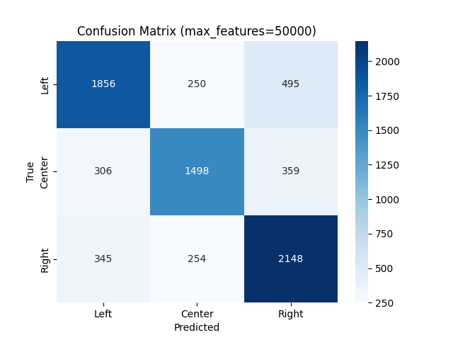

# Political Bias Detector (NLP + Web App)

This project is an end-to-end system that classifies the **political bias** (Left, Center, Right) of news articles using Natural Language Processing (NLP), Logistic Regression, and a Flask web app.

Users can either **paste article text** or **input a URL**, and the app will scrape the content, preprocess it, and return a prediction.

---

## Features

- Web scraping from user-provided URLs (BeautifulSoup)
- Preprocessing pipeline using NLTK
- TF-IDF vectorization of article text
- Logistic Regression classifier trained on labeled articles
- Confusion matrix visualization for evaluation
- Flask web app with simple HTML interface

---

## ⚙️ How It Works

### 1. Training the Model

```bash
python create_csv.py          # Extracts structured CSV from raw JSON
python preprocessing.py       # Cleans and lemmatizes the article text
python tf-idf.py              # Trains model and saves model/vectorizer
```

### 2. Running the Web App

```bash
python app.py
```

Then open your browser and go to `http://127.0.0.1:5000`

### 3. Predict from Command Line

```bash
python webscraper.py
```
Paste a URL when prompted, and it will scrape and predict the article's bias.

---

## 🧪 Model Performance

- Trained on labeled news data using TF-IDF (1–3 grams, 50k features)
- Logistic Regression model
- Evaluated with stratified test set and confusion matrix



---

## Requirements

Install dependencies:

```bash
pip install -r requirements.txt
```
Also make sure to download required NLTK data:

```python
import nltk
nltk.download('punkt')
nltk.download('stopwords')
nltk.download('wordnet')
```

